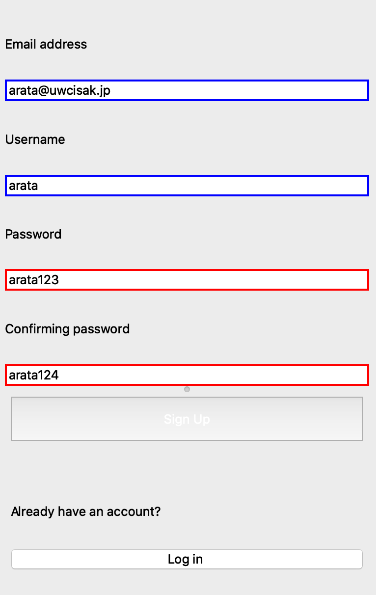

# Creating inventory 
Repo for unit 3

1. [Planning](#Planning)
2. [Design](#Design)
3. [Development](#Development)
4. [Evalutaion](#Evaluation)

Planning
====

### Defining the problem 
This is the email I received from my client: 

"Summer holidays start in a few months and I am starting to think of the packing process since I am going back home. I have been really worried I end up forgetting something important or that the number of things I have will not fit my bag and I may need to buy new luggage. For this reason, I need an inventory that will allow me to record the things that I have at the moment until the time when I start packing. This inventory needs to be divided into categories of type of items and its subtypes and must have a space for description, for example, the category clothes must have the subcategory of blouses and space where I can make a short description, eg: white with blue flowers. The things I have may vary a lot so I must be able to add any new category or subcategory to the system when I feel like the existing ones don’t categorize the item I need to add to the inventory."

To paraphrase this, my client, Lauricenia will be going back home by plane for this summer break, and she is having trouble keeping track of all the things she has to pack. At the moment she doesn't know how much belongings she has to bring home, and so she cannot decide if she should buy a new suitcase or not. She has the rest of the school year to figure this out, although she wants to make sure in advance of what and how much of things she has at the moment, to get an idea of what she can bring back home. 


### Solution proposed 
The solution is to create an inventory of packing list for my client so that she can keep track on her belongings. This inventory would be devided into categories, such as clothes, books, toiletries, etc. so that it is easier for her to spot ehat things she have in her room at the moment. It would also have subcategories, so for example, under clothes, there might be t-shirts, jackets, pants, etc. so that my client can have a better idea of her belongings. Since it is summer break and it is the longest break of the year, she wants to be precise about what she brings back home, to make sure that she has absolutely evrerything she needs throughout her entire summer. Also the inventory should record the amount of each belonging she has, as well as the total number of belongings per category and the total. Furthermore, weights of each category should be recorded, since she is getting on a plane for her transportation, and there is a limited number of weight per passenger. She needs to make sure that her luggage is not over the limit or else she would have to pay additional fee. Also by making the inventory editable, she can be able to add new categories, name the subcategories differently, update the weight of the belongings as well as the number, and so on. Finally to secure her inventory list, a secure login system will be required so that she is the only one who can check the inventory list. 

### Success Criteria
1. Registration can be done 
2. The user can login whenever they type the correct password and username 
3. The password is secured (not visible)
4. Whenever the user types in an incorrect information the boxes should indicate an error

1. seperating her belongings into different categories
2. category of the belonging is also seperated into different subcategories 
3. offers spaces for description 
4. shows the total number of objects 
5. shows the number of objects per category
6. shows the weight of objects per category 
7. secure login system is created 
8. storation of data while not using the app

### Justification of tool 
This program uses python as a programming language, and the tool used is PyCharm, an IDE specificated for python. IDE makes the development of the program easier than online platform, since it allows us to create multiple folders and files, which makes it easier to keep track of programs, especially when creating less simple programs. Python would be a good programming language when creating programs or softwares, since python has very kind syntaxes, as well as easier way of doing certain algorithm that cannot be done in other programming languages. It is developer-friendly, and therefore the usage of python and PyCharm as the platform for the dvelopment of this particular software.


Design
====

### Sketch of the app 


This is the first sketch of the app that I will be developing for my client.

The main window is the table of belongings that are seperated in different categories. These categories are each seperated in different subcateogries, and these columns are set to be buttons so that these can be selected and jump to another page about the information of the selected categories, which is what the subwindow is. Also on the main page there are weights of different categories shown. In the subwindow, there is another table, and here it shows the name of the object as well as its description. At the bottom it shows the total number of things in the subcateogory, and the weight of the objects. Furthermore there is an edit button, where it allows the user to edit the name of the categories, subcategories as well as the description of objects, the name of the objects and the number of weight. 

In the login window there are boxes that requires the user to type in their password and their username, since the client wanted the inventory to be confidential to other people. Below those, there are two buttons one is login and the other is sign up. When the user already have an account and typed in their login information correctly, then they will be able to jump to the main window. When they don't have an account they would need to sign up and create an account first. The signup form int eh sketch is almost like all the other sign up page. By setting the username, password, and email address the user will be able to login and look for their own inventory. 

### Updates sketch of the app

Development
====

## Registration

The preview for the login and sign up page are both inside the Appendix folder. 

For the sign up page, there are four input boxes for the user. The user has to enter ther email address, username, password, and same password for confirmation. In this sign up page these are the requirements:

1. Users are able to type in the line edits
2. WHen sign up button is pressed it should show if the information typed in are valid or not

For criteria number 2, to be more specific, when password typed in is all number or all letters, then the border of the text box should turn red, indicating that the information input by the user is invalid. Same goes for when the password for confirmation does not match the password user typed in the password text box. Also when there are text boxes that are not filled that text box should also turn red. 

When focusing on the requirements there were many requirements to cover, so I divided the work in to three. I created three different functions that perform the three actions for requirement number 2, and tested each of them if that works correctly. Then after checking that each program is working without malfunction, I decided to merge all the functions into one so that the code can be more efficient with less repitition of the same program. 

**Match Password**

This function checks if the two passwords typed in by the user are matching or not. If it matches then it should automatically go inside to the main page, otherwise it should the error by changing the dolor of the border of the box. 
Here is the code: 
```
    def matchPassword(self):
        password = self.lineEdit_4.text()
        confirmpass = self.lineEdit_2.text()

        if password != confirmpass:
            self.lineEdit_4.setStyleSheet("border: 2px solid red")
            self.lineEdit_2.setStyleSheet("border: 2px solid red")
            return
```
This code is located inside the signUpWindow class, since this is a method only used inside the sign up page. `self.lineEdit_4.text()` refers to the text input in the password box. The variables inside this function stores the user input. Down below in the if statement it is comparing the two inputs made by the users. `setStyleSheet()` is the syntax for using css to change the layout of the page. In this case I set the border color to be red only if the two passwords are not the same, so it indicated the invalid information to the user.

**If Empty**

This function focuses on checking if the user missed out on any information. If it detectd an empty box or boxes without information types in it would automatically indicate the user to type those in. Here is the code:
```
    def ifEmpty(self):
        username = self.lineEdit_3.text()
        password = self.lineEdit_4.text()
        confirmpass = self.lineEdit_2.text()
        email = self.lineEdit_1.text()

        if username == "":
            self.lineEdit_3.setStyleSheet("border: 2px solid red")
        else:
            self.lineEdit_3.setStyleSheet("border: 2px solid blue")
        if password == "":
            self.lineEdit_4.setStyleSheet("border: 2px solid red")
        else:
            self.lineEdit_4.setStyleSheet("border: 2px solid blue")
        if confirmpass == "":
            self.lineEdit_2.setStyleSheet("border: 2px solid red")
        else:
            self.lineEdit_2.setStyleSheet("border: 2px solid blue")
        if email == "":
            self.lineEdit_1.setStyleSheet("border: 2px solid red")
        else:
            self.lineEdit_1.setStyleSheet("border: 2px solid blue")
```
This is a code with simple if statements. These if statements detect whether the information contained in the box is null or not. It goes through every text boxes and show the result. 

**Invalid Password**

Finally for this function, it checks the validity of the password. If the password is only numbers or only letters it gives out error. Here is the code for this program:
```
    def invalidPass(self):
        password = self.lineEdit_4.text()

        if password.isdigit() or password.isalpha():
            self.lineEdit_4.setStyleSheet("border: 2px solid red;")
            return "invalid input"
        else:
            self.lineEdit_4.setStyleSheet("border: 2px solid blue;")
            return "valid input"
```
This is also a simple if statement. If the password is all digit, or if the password is all alpha, meaning letters, then the border of the text box would become red. If the passord is not, and is a mixture of both, then it would show a blue indicating that the password is valid.

### The entire program for sign up page 
```
class signupWindow(signupForm):
    def __init__(self, parent=None):
        super(signupWindow, self).__init__(parent)
        self.setupUi(self)

        self.lineEdit_1.setPlaceholderText("2020.uwc.isak@uwcisak.jp")
        self.lineEdit_3.setPlaceholderText("uwc isak")
        self.lineEdit_4.setPlaceholderText("mixture of letters and numbers")
        self.lineEdit_2.setPlaceholderText("Enter the same password")
        # pushButton_2 = loginButton
        # If the user already has an account go back to the login page
        self.pushButton_2.clicked.connect(self.openlogin)
        self.pushButton.clicked.connect(self.regCheck)

    def openlogin(self):
        login = loginWindow(self)
        login.show()

    def openMain(self):
        main = mainWindow(self)
        main.show()

    def regCheck(self):
        username = self.lineEdit_3.text()
        password = self.lineEdit_4.text()
        confirmpass = self.lineEdit_2.text()
        email = self.lineEdit_1.text()

        # Create list variable
        passList = []

        if username == "":
            self.lineEdit_3.setStyleSheet("border: 2px solid red")
            passList.append("invalid")
        else:
            self.lineEdit_3.setStyleSheet("border: 2px solid blue")
            passList.append("pass")
        if password == "" or password.isalpha() or password.isdigit():
            self.lineEdit_4.setStyleSheet("border: 2px solid red")
            passList.append("invalid")
        else:
            self.lineEdit_4.setStyleSheet("border: 2px solid blue")
            passList.append("pass")
        if confirmpass == "" or confirmpass.isdigit() or confirmpass.isalpha():
            self.lineEdit_2.setStyleSheet("border: 2px solid red")
        else:
            if confirmpass == password:
                self.lineEdit_2.setStyleSheet("border: 2px solid blue")
                passList.append("pass")
        if email == "":
            self.lineEdit_1.setStyleSheet("border: 2px solid red")
        else:
            self.lineEdit_1.setStyleSheet("border: 2px solid blue")
            passList.append("pass")
```

One issue while I was developing this program is that, I couldn't change the name of each text boxes and buttons. I said `setObjectName` and trid to change the names of these, so then it would be much easier. Although I couldn't manage to do this.

In this code, first I have method called "openlogin", which gets called only when the login button in the page is pressed by the user. This button is for the people who already have an account and don't need to create a new one. This operation is controlled by the line `self.pushButton_2.clicked.connect(self.openlogin)`.

The the second method is called "openMain". This function should only be called when the sign up button is pressed, under the circumstance that all the required information by the user is typed correctly, without any errors. This "checking the information" is done by the "regCheck" method. 

In the regCheck method, it contains all the three functions, "match pwd", "if emtpy", and "invalid pwd". It does the exact same thing, the difference is that they're all in one. Which is why there are many conditions inside the method. 

Although one problem was that I didn't know how to write a program so that the if all the information are correctly typed in then it would automatically go to the main page. So I had to modify some of the code in order to get the functionality that I was looking for and this is the new modified code that I came up with:

```
    def openlogin(self):
        login = loginWindow(self)
        login.show()

    def openMain(self):
        main = mainWindow(self)
        email = self.lineEdit_1.text()
        username = self.lineEdit_3.text()
        password = self.lineEdit_4.text()
        confirmpass = self.lineEdit_2.text()
        if self.checkMail(email) is True and self.checkUsername(username) is True and self.checkPwd(password) is True and self.conPass(password, confirmpass) is True:
            main.show()

    def checkPwd(self, password):

        if password == "" or password.isalpha() or password.isdigit():
            self.lineEdit_4.setStyleSheet("border: 2px solid red")
        else:
            self.lineEdit_4.setStyleSheet("border: 2px solid blue")
            return True

    def conPass(self, password, confirmpass):
        if confirmpass == "" or confirmpass.isdigit() or confirmpass.isalpha():
            self.lineEdit_2.setStyleSheet("border: 2px solid red")
        else:
            if confirmpass == password:
                self.lineEdit_2.setStyleSheet("border: 2px solid blue")
                return True

    def checkUsername(self, username):
        if username == "":
            self.lineEdit_3.setStyleSheet("border: 2px solid red")
        else:
            self.lineEdit_3.setStyleSheet("border: 2px solid blue")
            return True

    def checkMail(self, email):
        if email == "":
            self.lineEdit_1.setStyleSheet("border: 2px solid red")
        else:
            self.lineEdit_1.setStyleSheet("border: 2px solid blue")
            return True
```
In this program what is different is that I actually divided the functions back into small bits. What I wanted to do was that I wanted to check if all the functions return True or not, and if does then it should open the main page. This is why I seperated all the functions so that it can either return true or nothing for each one. This enabled me to say that if all the test passes, then it can open the main page. This code works completely fine, although I thought that it was hard to read. I tried to repeat the same thing again and again, for example the line `variableName = self.lineEdit_n.text()`. I couldn't figure out how to create a variable in a class that can be used in method within the class, and I did manage to do this by setting a parameter in each function, that has the same name as the variable. Although, this made things rather complicated, and the code is now very hard to read, and unorganized. Thus I decided to reorganize the code again, with the same function but easier to understand and check. Also I added a new method called storeSecureInfo and this allows the user information to be encrypted and stored. The mechanism will be explained below. This is the new and final code:
```
    def openlogin(self):
        login = loginWindow(self)
        login.show()

    def checkUsername(self):
        username = self.lineEdit_3.text()
        if username.isalpha() or username != "":
            self.lineEdit_3.setStyleSheet("border: 2px solid blue")
            return True
        self.lineEdit_3.setStyleSheet("border: 2px solid red")
        return False

    def checkEmail(self):
        email = self.lineEdit_1.text()
        if "@" not in email or email.isdigit() or email == "":
            self.lineEdit_1.setStyleSheet("border: 2px solid red")
            return False
        self.lineEdit_1.setStyleSheet("border: 2px solid blue")
        return True

    def checkPassword(self):
        password = self.lineEdit_4.text()
        if password.isalpha() or password.isdigit() or len(password)<6 or password == "":
            self.lineEdit_4.setStyleSheet("border: 2px solid red")
            return False
        self.lineEdit_4.setStyleSheet("border: 2px solid blue")
        return True

    def checkConfirmedPassword(self):
        password = self.lineEdit_4.text()
        confirmedPassword = self.lineEdit_2.text()
        if password == confirmedPassword and password != "" and confirmedPassword != "":
            self.lineEdit_4.setStyleSheet("border: 2px solid blue")
            self.lineEdit_2.setStyleSheet("border: 2px solid blue")
            return True
        self.lineEdit_4.setStyleSheet("border: 2px solid red")
        self.lineEdit_2.setStyleSheet("border: 2px solid red")
        return False

    def checkRegistration(self):
        self.checkUsername()
        self.checkEmail()
        self.checkPassword()
        self.checkConfirmedPassword()
        if self.checkUsername() is True and self.checkEmail() is True:
            if self.checkPassword() is True:
                if self.checkConfirmedPassword() is True:
                    self.openMain()
                    self.storeSecureInfo()

    def openMain(self):
        main = mainWindow(self)
        main.show()

    def storeSecureInfo(self):
        username = self.lineEdit_3.text()
        password = self.lineEdit_4.text()
        hashedInfo = myLib.hashPassword(username + password)
        with open('output.txt','a') as outputFile:
            outputFile.write(f"{hashedInfo}\n")
        self.close()
```
First of all what I did in this code is that, I changed the names of the methods, because in the previous code, I focused too much on how to shorten the method names, that it became hard to understand which method does what. Therefore in this new code, I changed the name to something that is a little bit longer, but more explicit. In this way we can tell what method does what immediately. Second, I replaced the variables of the texts. I decided to repeat the variable each time in different methods, because I thought that this is the most simple way, and it is easy to understand. Also for the step that checks if all the methods retur true or not, I put that into a whole new method called checkRegistration whereas initially I had it in the openMain method. This too, is for th reason of making it as simple as possible. I wanted the openMain method to only be dedicated on that one move and nothing else, because it makes things much more easier. Finally for the new method, it's functionality is that, it takes the username as well as the password and it encrypts them and store it in a txt file called output.txt. This becomes very important when the user wants to log into their own account, because the username and the password will be securely stored in the program. In the method it says `hashedInfo = myLib.hashPassword(username + password)`, and this function hashPassword does the encrypting part. This explanation is in the section "Secure Login System".


## Login in 

In the login page, what the user needs to be able to do is to type in their username and password, and if they entered the correct information, then they should be able to go inside the main page. The username and the password should come from the information they entered in the sign up page. Only if the typed in information in the login page, matches with the information that the user typed in for registration previously, then they should be able to access their inventory. 
```
class loginWindow(login):
    def __init__(self, parent=None):
        super(loginWindow, self).__init__(parent)
        self.setupUi(self)
        self.username.setPlaceholderText("enter username")
        self.password.setPlaceholderText("enter password")

        # pushButton = signupButton
        self.pushButton.clicked.connect(self.opensignup)
        # password -> black dot
        # self.password.setEchoMode(QLineEdit.Password)
        self.loginButt.clicked.connect(self.checkLoginInfo)

    def openMain(self):
        main = mainWindow(self)
        main.show()

    def opensignup(self):
        signup = signupWindow(self)
        signup.show()

    def checkLoginInfo(self):
        username = self.username.text()
        password = self.password.text()
        outputFile = open('output.txt', 'r')
        count = 0
        for line in outputFile:
            count += 1
            if myLib.verifyPassword(line, username + password) is True:
                self.username.setStyleSheet('border: 2px solid blue')
                self.password.setStyleSheet('border: 2px solid blue')
                # self.close()
                self.openMain()
                break
            else:
                self.username.setStyleSheet('border: 2px solid red')
                self.password.setStyleSheet('border: 2px solid red')
```
This is the full code for the login page. In this class there are three methods. There is the openMain and openSignup method, which simply opens the main page and the signup page. The third method is called the checkLoginInfo, and this method is the most important one. In this method, it takes the username and password typed in by the user, and basically what it does is that it compares the encrypted version of those two values with the stored value in output.txt. This stored value is the encrypted username and password that was typed in the sign up page. This is where the storeSecureInfo in the signUpWindow class and this method link together. When receiving the stored value from output.txt, it is programmed so that it reads one line each, so that multiple users can use the app. The received information is now compared to the new hashed information. These processes are all done in the verifyPassword function located in myLib, and there will be a brief explanation about this later on. If this function returns true, meaning if the two values, the stored and the provided information, are matching then it opens the main page, and simultaneously close the login page. Otherwise, it would indicate an error by changing the color of thw text box.


## Secure Login System 
This secure login system is to increase the security for the user so that their personal data will not be stolen or seen without permission. There are two main functions that shape up this system:
```
import hashlib, binascii, os

def hashPassword(password):
    salt = hashlib.sha256(os.urandom(60)).hexdigest().encode('ascii')
    pwdhash = hashlib.pbkdf2_hmac('sha512', password.encode('utf-8'), salt, 100000)
    pwdhash = binascii.hexlify(pwdhash)
    return (salt + pwdhash).decode('ascii')

def verifyPassword(storedPassword, providedPassword):
    salt = storedPassword[:64]
    storedPassword = storedPassword[64:-1]
    print(storedPassword)
    pwdhash = hashlib.pbkdf2_hmac('sha512', providedPassword.encode('utf-8'), salt.encode('ascii'), 100000)
    pwdhash = binascii.hexlify(pwdhash).decode('ascii')
    print(pwdhash)
    return pwdhash == storedPassword
```
In the hashPassword function, first of all it creates something called the salt. In the line `salt = hashlib.sha256(os.urandom(60)).hexdigest().encode('ascii')`, the default size of a hash is 64 bytes, and they are converted into worth 64 bytes of ascii characters. Basically salt is a set of information that randomly generated, just to make the password harder to decode. Then in `hashlib.pbkdf2_hmac('sha512', password.encode('utf-8'), salt, 100000)`, it hashes the encoded password using the salt that has been generated, and that information is made to 64 bytes, and that process will be repeated 100000 times, so that it would become more random. Then after that it is encoded 2 bytes hexadecimal string. Thus the return value is the value of the hashed password but with the salt in front of it. This function was called in the signupWindow class' storeSecureInfo method. In this case the parameter was the password that the user typed in to the password text box. And this new value generated through the hashPassword function is stored into a text file so that it can be retrieved and compared in the later process. 

In the verifyPassword function, it almost does the same thing. The password provided by the user in the login page, is taken as the parameter providedPassword, and this is hashed using the exact same process in the previous function. What is different in this function is that this function is to compare the two values: the stored value that was created with the hashPassword, and the hashed provided password. What it does to compare these two values, is first it retrieves the stored password (the function itself doesn't but in the checkLoginInfo method it does), and it checks for the salt. The salt is the first 64 digits, so it neglects all of that and takes the rest of the value which is supposedly the hashed password. If this matches the newly hashed password, then the user will be able to go in their page. This function returns a boolean, and if it is true, then it will go to the main page.


Evaluation 
=== 

All the videos for proof are in the folder testAppendix.

## Checking the first four criterias:
1. Registration can be done 
2. The user can login whenever they type the correct password and username 
3. The password is secured (not visible)
4. Whenever the user types in an incorrect information the boxes should indicate an error

For registration, what the user should be able to do is to type in their information in the text boxes. Also it should tell the user of the information is valid or not by the color of the boxes. Only when all the information is typed in correctly, then the user can access the main page. 
For example if the passwords don't match:


then the outcome is this. 
Although if all the information were typed in correctly: 


then the outcome would be something like this. Therefore we can say that success criteria 1 and 4 is met.

For the login page, first of all the password should not be visble to prevent people from stealing the users password:


Also when the user types in the correct password and username they should be able to successfully login and access their main page:


Otherwise it should not let the user in, and also indicate an error by changing the color of the text box to red.


From these, we can say that criteria 2, 3, and again 4 were met. 


## Testing the buttons 

This test is to evaluate the functionality of the buttons. It tests whether the button redirects the system to the right page, and whether it should perform the correct function. 

### Login Page
**Login Button**

This button should:
1. Check if the username is correct 
2. if the password is correct 
3. If both information are correct it should go in to the main page (their inventory)

**Signup Button**

This button should take the user to sign up form. 

### Signup Page
**Signup Button**

This button should:
1. Check if every detail are valid -> if not the boxes that contains invalid information should turn red
2. Go back to the login button 

**Login Button**

This button should go back to the login page.

## Checking Secure login system 

This is the test for the password system. If the user types the username and password that has already been registered it should lead them to the main page. 

When the user typed in the correct password which was "arata713"


